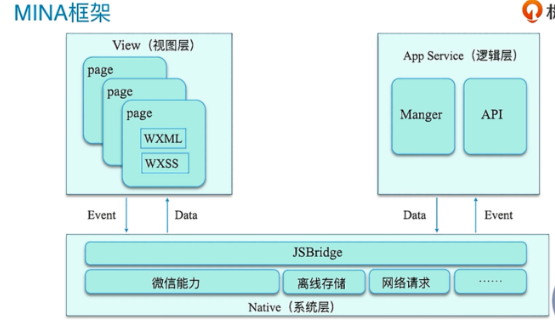
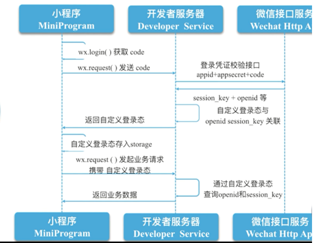
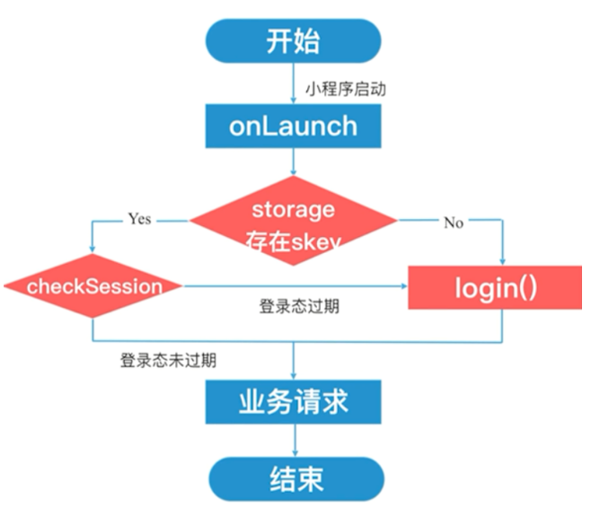

接上一篇小程序初体验
<!-- more -->
### 有关样式

```js
内联样式可以配合数据绑定

<view style="width:500rpx;height:30px;background-color:{{colorValue}};"></view>
Page({
    data:{
        colorValue:'red'
    }
})

静态样式写入类class,动态样式写入style内联样式中
选择器权重雷同，!important一般用在修改使用插件的样式
```


### MINA框架



### 运行机制
#### 启动(热启动与冷启动)(小程序没有重启的概念)

热启动：假如用户已经打开过某小程序，然后在一定时间内（五分钟）再次打开该小程序，此时无需重新启动，只需将后台态的小程序切换到前台

冷启动：用户首次打开或小程序被微信主动销毁后再次打开的情况，此时小程序需要重新加载启动。
那么什么情况下会销毁，主要是两种情况
1. 小程序进入后台，客户端会维持一段时间的运行状态，超过一定时间后（目前是5分钟）会被微信主动销毁
2.  当短时间内（5s）连续收到两次以上收到系统内存告警，会进行小程序的销毁

#### 更新
在冷启动的时候如果发现新版本，将会异步下载新版本的代码包，并同时用客户端本地的包进行启动，即新版本的小程序需要等下一次冷启动才会应用上。 如果需要马上应用最新版本，可以使用 wx.getUpdateManager API 进行处理，这个API调用代码放在app.js的onLaunch。
```js
// 获取小程序更新机制兼容
    if (wx.canIUse('getUpdateManager')) {
      const updateManager = wx.getUpdateManager()
      updateManager.onCheckForUpdate(function (res) {
        // 请求完新版本信息的回调
        if (res.hasUpdate) {
          updateManager.onUpdateReady(function () {
            wx.showModal({
              title: '更新提示',
              content: '新版本已经准备好，是否重启应用？',
              success: function (res) {
                if (res.confirm) {
                  // 新的版本已经下载好，调用 applyUpdate 应用新版本并重启
                  updateManager.applyUpdate()
                }
              }
            })
          })
          updateManager.onUpdateFailed(function () {
            // 新的版本下载失败
            wx.showModal({
              title: '已经有新版本了哟~',
              content: '新版本已经上线啦~，请您删除当前小程序，重新搜索打开哟~',
            })
          })
        }
      })
    } else {
      // 如果希望用户在最新版本的客户端上体验您的小程序，可以这样子提示
      wx.showModal({
        title: '提示',
        content: '当前微信版本过低，无法使用该功能，请升级到最新微信版本后重试。'
      })
    }
```


### 生命周期
#### 程序的生命周期
onLaunch onShow onHide  onError
#### 页面的生命周期
1. onLoad 页面初次加载的时候调用，页面销毁前只调用一次 在回调中可以得到打开参数
2. onShow  页面显示后调用 从别的页面到这也会调用
3. onReady 初次渲染完成调用 在onShow之后调用  销毁前只有一次
4. onHide 打开新界面的时候，当前页面调用
5. onUnload 关闭界面的时候调用

### 路由

路由方式 |触发时间|路由前页面调用啥
---|---|---
初始化  | 小程序打开的第一个界面
打开新界面 | wx.navigateTo == <navigator open-type="navigateTo"/>|onHide
重定向 |wx.redirectTo == <navigator open-type="redirectTo"/>|onUnload
返回 |wx.navigateBack == <navigator open-type="navigateBack"/>|onUnload
Tab切换 |wx.switchTab == <navigator open-type="switchTab"/>
重启 |wx.relaunch == <navigator open-type="relaunch"/>|onUnload


### 登录流程图






### 遇到的坑

在用code换取到session_key和openid时，直接data.openid是拿不到的，经过检验类型，此时返回的是json字符串，需要自行JSON.parse()

wx.getUserInfo 不能用了 需要用button打开类型设定为getUserInfo才能