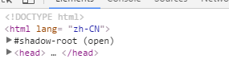
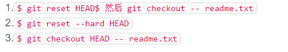
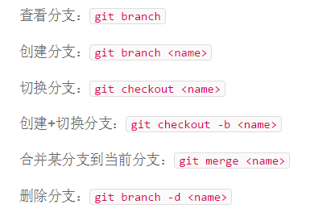

javascript部分
express部分
git部分
博客部分

<!--more-->

## javascript部分
大致进度就是红宝书的前五章以及第六章中部了，差点小尾巴，以下是随手列一些
1、< script>元素用于在html中插入js的代码，可以用src属性导入内部或外部的的js文件或者url。< script>的代码按照先后顺序解析，一般放在body的内容的后面，用defer async可以就可以实现延迟或异步解析脚本 

2、在网页在开头写"use strict"进去严格模式
3、文档模式分混杂和标准，经常见到这样子的html5标准模式

4一些基础概念在之前学习Node的时候了解过了，操作符，语句也跟C语言差不多我觉得

5、很多地方对象调用valueof的时候会自动地间接地调用toString(),所以我的理解是valueof返回的是最适合该对象类型的原始值

6、这个应该不怎么会用到，先记录下来吧infinity*0=NaN infinity/infinity=NaN
被除数有限而除数无穷=被除数，被除数无穷 而除数有限=NaN

7、以前没见过with语句，对同一个对象多个操作的时候可以用with（）{}限制作用域

8、垃圾收集机制跟java的差不多，js最常用的垃圾收集方式还是标记清除

9、执行环境，就是作用域，每一门语言这个都是很重要的内容，js没有块级作用域,比如下面这个
```javascript
    if(true){ var color='blue';}
    alert(color);
```    
 在C或C++,JAVA中 color是局部变量，执行完if语句后就销毁了，但是在js中不会，该变量会自动添加到最近的执行环境，这里是全局

10、几大引用类型Object,Array,Date跟Java类似，学习基本包装类型的时候我竟然想到了java里的自动装箱？差不多吧我觉得；RegExp这个类型之前没接触过，跟正则表达式挂钩..我觉得需要先去学一下正则表达式的种种，做考核的时候有想着给登录注册那里加一个检测机制，判读用户的输入是否符合格式，在这里就用到了正则，当然那个时候个人是粗略看了一下而已


## express部分
其实一开始是先看着发在群里的那个《node与express开发》，看到handlebars前面那块就先打住了，因为在第四章的时候提到，要么跟随书本的实例手动，要么用官方的存储库，突然就想起git的各种命令。。所以在第六章结束后就去了网上找了资料补了下git和github的内容，还挺详细的。
PS：认识一个新的东西QA，质量评价，竟然还有专门的QA职业，大千世界无奇不有

## git部分
万物起源于init初始化一个本地仓库
先git add 再 git commit -m"说明文字"
git status查看工作区状态，有什么改动，提交都可以看到，贼方便。
git diff可以看到改动了啥
git log查看提交历史
git reflog查看命令历史，配套使用来确定版本号用来控制版本 参数 --pretty=oneline美观点，跟db的命令find().pretty()一个道理，毕竟丑是原罪
git reset --hard xxxx(版本号或者HEAD^) 版本号可以不用打完整的，太长了

文件已修改，未add到暂存区:git checkout - - file可还原
文件已修改，并add到暂存区未commit：三种方法，第一种好理解，其余的是从网上找来的另外的方法

关联github的操作git remote add origin git@github.com:git_username/repository_name.git
git push origin master推送最新修改到github

git clone git@github.com:xxxx 可以克隆别人的库，我在这周搭博客的时候，有试过切换主题，clone就发挥作用了

git tag+标签名+版本号 作用就是给版本起个名v1.9v2.0
 
## 博客部分
最常用的几个命令
hexo g  生成静态文件
hexo d  deploy我的理解就是部署到github
hexo s  本地浏览 localhost:4000
hexo n “文章名”   创建一个文档，然后就写写写（要用markdown语法，除了在马克飞象用的那些，应该还有更多可以让文章更漂亮的？）
<!-- n完要发布三步走 clean g d(试过不用hexo clean，就不能够看到新编辑的文章，不知道为啥一定要先clean？) -->

要做出一个像模像样的博客还有好多东西要搞，慢慢来吧哈哈哈，现在就是一个丑东西，也还没有搞一个域名来绑定，晚点弄一个来van