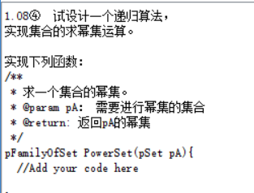
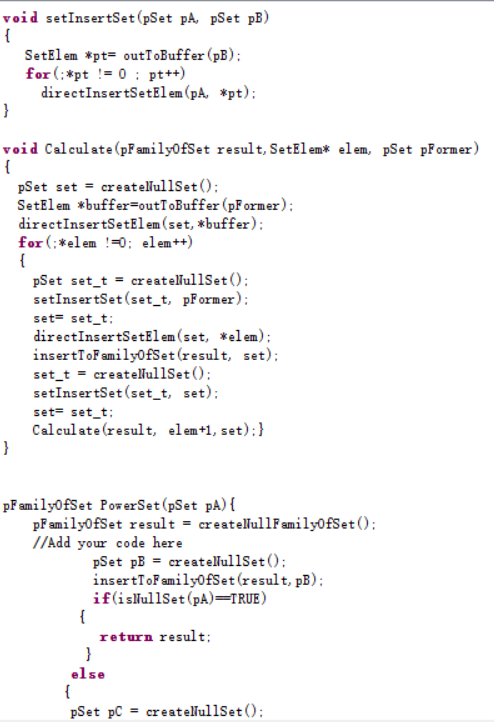
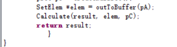

 考试月了，主要是在准备考试，学课程的东西以及准备六级
 <!--more-->
 ## 博客
 给博客换了一个主题，以及加了一个音乐播放器，以前用网易云的时候就发现有个功能“生成外链播放器”
 本来是想放幻界战线的hello world的，挺喜欢这首歌，竟然锁区不给。。虽然可以破解这个版权保护，还是算了，放了个纪念龙族绘梨衣的bgm
 
 还改了一些杂七杂八的，干货分享有个steam便利店，可以优惠价买steam的游戏或者低价买随机cdk，贼好的东西，需要的可以看看
   ***
 ## javascript
 因为忙着课程和四六级的，没有学太多，就把上次留下的小尾巴看了看，几种设计模式和几种继承(后续准备开一个单章处理这个问题)
 ***
 ## 课程杂谈？（只是想吐槽下罢了）
 要六级啦，就试听了一次听力，难得一批，更别说单词还没刷完，周六的模拟考竟然是因为学委打王者入神忘记发通知？？？(excuse me?)

 高数还行吧，电工依旧要命，这周还没能把时间放在电工上
 
 离散的anyview也是要命的，就拿今晚的事，做这一道题，递归运算足足花了我一小时。。C语言和算法退化了啊
 
 附上做的答案（要不是同学请教，且网上没有这道题的答案，哪用这么受罪TAT）
 
 
 
 啊~~还是刷刷单词去了